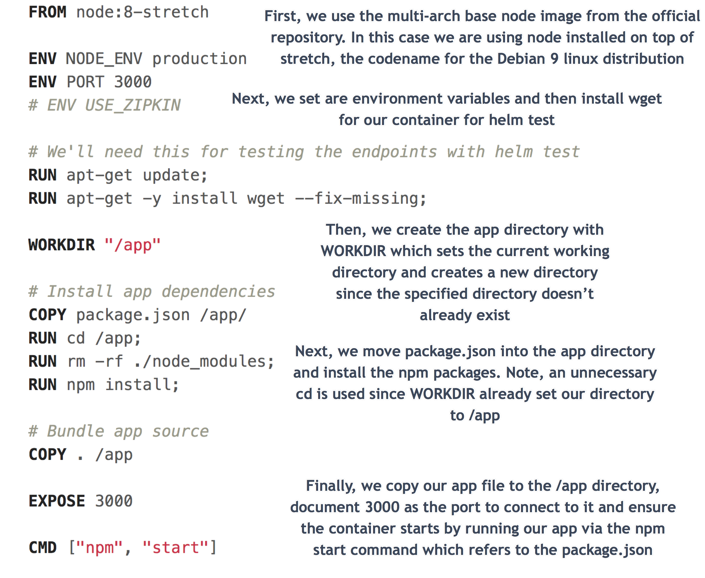
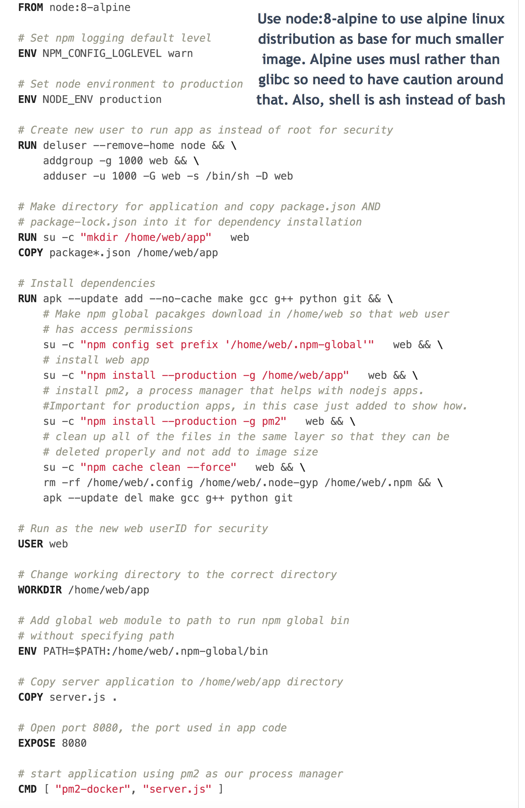

# 2. Making Node.js apps with Docker
First, we will go over the icp-node-js-sample app and Dockerfile. Then, show Dockerfile best practices for nodejs using the basic hello world app from Node.js site.

### Node.js Download for Later
Here is the [Node.js download](https://nodejs.org/en/) if you want to run it locally to familiarize yourslef with it/develop with it. For this tutorial, you actually don't need Node.js installed on your computer because of the magic of docker.

## ICP Node.js Sample
From the main directory for this `MultiArchDockerICP` tutorial go into `icp-nodejs-sample` directory. Here, open up the `Dockerfile`. The code for this project comes from [ibm-cloud-private-nodejs-sample](https://github.com/ibm-developer/icp-nodejs-sample)Let's see what we got here folks.

Run it with `docker run --rm -p 3000:3000 gmoney23/nodejs-sample` and go to `localhost:3000` in web browser to see it.

## Node.js Hello World Server
From the main directory for this `MultiArchDockerICP` tutorial go into `node-web-app` directory. Here, open up the `Dockerfile` and see comments for how to write best practice Node.js Dockerfile. The simple code we're dockerizing for the web app comes from this [Node.js tutorial](https://nodejs.org/en/docs/guides/nodejs-docker-webapp/)

Run it with `docker run --rm -p 3000:8080 gmoney23/node-web-app` and go to `localhost:3000` in web browser to see it.

For further help in crafting the best docker images possible for Node.js see [Node.js Docker Best Practices](https://github.com/nodejs/docker-node/blob/master/docs/BestPractices.md)

[Time to get go-ing](3-Best-Practice-go.md)
