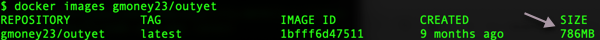
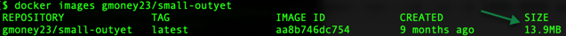
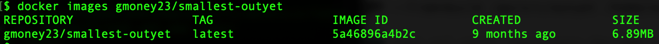
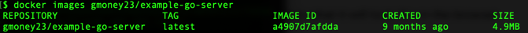

# 3. Guide to Building Best-practice Go Docker Images

We will go over three apps and show how to optimize our Golang code for Docker.

1. Go example Outyet program
2. Go Hello world
3. Go href-counter

*Note: We will build all of these images in Part 4. This is a guide explaining the ins and outs of making the files to do so [i.e. the foundation for success]*


### But first...Download Go for later
Here is the [Go download](https://golang.org/dl/) if you want to run it locally to familiarize yourself with it/develop with it. For this section, you actually don't need golang installed on your computer because of the power of Docker.

## If Using Proxy
If using proxy, make sure you've read [0-ProxyPSA](0-ProxyPSA.md) and have set your `http_proxy`, `https_proxy`, and `no_proxy` variables for your environment as specified there. Also note that for all docker run commands add the `-e` for each of the proxy environment variables as specified in that 0-ProxyPSA document.

## Outyet
Outyet is a go example program from [Go Outyet Example](https://github.com/golang/example/tree/master/outyet). This app checks if the version of Go specified (in our case 1.11 is out yet). Since we are using it, it better be! We will be dockerizing this app, shrinking our image down on the way over 3 iterations.

### Iteration 1: Outyet
In this first iteration we make the go app in a container and get it running. Since there is a large base image needed for compiling the application and a large os is used for that image, this will be a rather large container. Here is the [outyet Dockerfile](https://github.com/siler23/MultiArchDockerICP/blob/master/outyet/Dockerfile). Read the comments below for details about the Dockerfile.


Run it with:

```
docker run --rm -it -p 3000:8080 gmoney23/outyet
```

*Note: This should just hang in the cli:*


The real action is in the browser. 

Click on <a href="http://localhost:3000/" target="_blank">outyet</a> (while it's running) to see it in your web browser.

If you're on a server instead of a desktop go to `http://serverip:3000` where serverip is your server's ip address.

It should look like this:


Here's the git page for go 1.11 when you click YES 


**Quit the app by hitting both the control and c keys (ctrl c) in the terminal/ command prompt / PowerShell.**

To check it's size I ran:

```
docker images gmoney23/outyet
```

I got a whopping 786 Mb, no room for dessert :(



*Seeing the room for improvement fills us with determination ...*

### Iteration 2: Small-outyet
In this second iteration, we attempt to improve upon our original endeavor using multi-stage builds. What is a multi-stage build? A build that happens in multiple stages. Mic drop...[Docker multi-stage build](https://docs.docker.com/develop/develop-images/multistage-build/). Employing multi-stage builds we can build the golang application in a container with all the bells and whistles and then copy it to another container that is much smaller. Here, we just run it. This works well with golang because when we set `CGO_ENABLED=0` everything is statically compiled. In this case, we're going to copy it into the Alpine base image which should cut down its size considerably. Without further ado, the [small-outyet Dockerfile](https://github.com/siler23/MultiArchDockerICP/blob/master/small-outyet/Dockerfile) below:


Run it with 

```
docker run --rm -it -p 3000:8080 gmoney23/small-outyet
```

Click on <a href="http://localhost:3000/" target="_blank">small-outyet</a> (while it's running) to see it in your web browser.

If you're on a server instead of a desktop go to `http://serverip:3000` where serverip is your server's ip address.

*Note: The cli hangs and the web page looks the same as for `outyet`, since it's the same app, so I've omitted images here.*

**Quit the app by hitting both the control and c keys (ctrl c) in the terminal/ command prompt / PowerShell.**

To check it's size I ran:

```
docker images gmoney23/small-outyet
```



From 786MB -> 13.9MB that's some serious shrinkage.

*The amount the container has shrunk fills us with determination...*

### Iteration 3: Smallest-Outyet
How do we get smaller than starting with a 5MB alpine image? How about start with nothing. We are going to use the special [scratch image](https://hub.docker.com/_/scratch/) which starts fresh. Since everything can be set to statically compile in go with `CGO_ENABLED=0`, we can just package the binary in a container without even a shell. This lessons attack surface and gives us a super light image. On top of that, we'll add some compiler flags for production to cut off the debug info space in go. Here's how it all looks in the [smallest-outyet Dockerfile](https://github.com/siler23/MultiArchDockerICP/blob/master/smallest-outyet/Dockerfile)


Run it: 

```
docker run --rm -it -p 3000:8080 gmoney23/smallest-outyet
```

Click on <a href="http://localhost:3000/" target="_blank">smallest-outyet</a> (while it's running) to see it in your web browser.

If you're on a server instead of a desktop go to `http://serverip:3000` where serverip is your server's ip address.

*Note: You know the drill. The cli hangs and the web page looks the same as for `outyet` and `small-outyet`, since it's the same app, so I've omitted images here.*

**Quit the app by hitting both the control and c keys (ctrl c) in the terminal/ command prompt / PowerShell.**

To check it's size I ran: 

```
docker images gmoney23/smallest-outyet
```



***From 13.9MB -> 6.89MB for a grand transformation of 786MB -> 6.89MB, a little over 114X smaller than the original image! That's a lot of room for dessert :)***

## Why was our Go Container Transformation Worth it?

### Security

Running the container from scratch enables us to take away even a shell into our container. The only software we are adding to the container is the executable that needs to run. This dramatically reduces the attack surface and means you don't need to worry about the security patches for the libs/bins you are adding in your container (since you aren't adding any). You simply need to worry about the security of your application itself and the pieces it is made with.

### Size

By minimizing the size of images, we can prevent wasting resources for large base images and prevent using a ton of storage for all of our container images. Moreover, we can take better advantage of cache for our running containers.

### Clarity

It is easy to see exactly what we are doing in our container and we don't need to worry about potential problems when updating the bins/libs of our container because we don't have any.

If the scratch image has piqued your interest, check out this article exploring ["Inside Docker's FROM scratch"](https://www.mgasch.com/post/scratch/)

## Go Hello world
Using the techniques we just employed, let's see how small of a Docker image we can make for a [basic go hello world app](https://gist.github.com/enricofoltran/10b4a980cd07cb02836f70a4ab3e72d7) from gist.
Say hello to the [example-go-server Dockerfile](https://github.com/siler23/MultiArchDockerICP/blob/master/example-go-server/Dockerfile).


Run it with:

```
docker run --rm -it -p 3000:5000 gmoney23/example-go-server
```

Click on <a href="http://localhost:3000/" target="_blank">example-go-server</a> (while it's running) to see it in your web browser.

If you're on a server instead of a desktop go to `http://serverip:3000` where serverip is your server's ip address.

Here is what it will look like in the browser:


**Quit the app by hitting both the control and c keys (ctrl c) in the terminal/ command prompt / PowerShell.**

Here's what it will look like in the cli after its been shut down.


To check its size I ran:

```
docker images gmoney23/example-go-server
```



This gives us an image size of 4.9MB, quite astounding!

## Href-Counter
Finally, lets dockerize an app that prints output for us instead of a web app. [Href-counter](https://github.com/alexellis/href-counter) is an application that counts the number of internal and external-hrefs on a web-page to rate SEO. It is referenced in the multi-stage build manual for docker we looked at [before](https://docs.docker.com/develop/develop-images/multistage-build/) and fits the bill for us. Let's take a peak at the [href-counter Dockerfile](https://github.com/siler23/MultiArchDockerICP/blob/master/href-counter/Dockerfile) inside of MultiArchDockerICP.


*Note: This tool is operating on live websites so numbers will change as sites are updated, altering their internal and external hrefs*

We can try the tool out against different sites (starting with this site) using:

```
docker run --rm -e url=https://siler23.github.io/MultiArchDockerICP/ gmoney23/href
```

`{"internal":35,"external":9}`

**Note: For PROXY**: add your -e for http_proxy, etc.:

```
docker run --rm -e http_proxy=%http_proxy% -e https_proxy=%https_proxy% -e no_proxy="%no_proxy%" -e url=http://google.com href
```

**More Examples**

```
docker run --rm -e url=http://yahoo.com gmoney23/href
```

`{"internal":29,"external":82}`

```
docker run --rm -e url=http://blog.alexellis.io/ gmoney23/href
```

`{"internal":51,"external":2}`

You'll be pleased to know our Dockerfile made this image small as well. We can see with:

```
docker images gmoney23/href
```


For more go best practices and tips with Docker see this [excellent article](https://blog.docker.com/2016/09/docker-golang/)

# [Part 4: Bringing Multi-arch Images to a Computer Near You!](4-Build-MultiArch.md)
