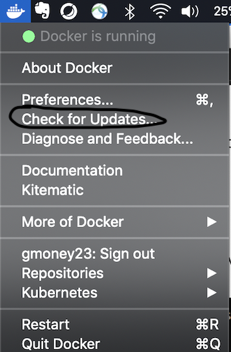
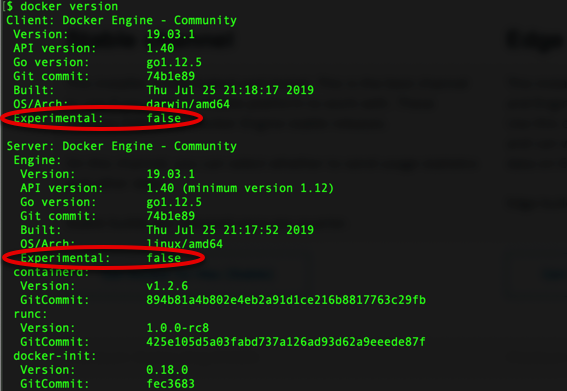
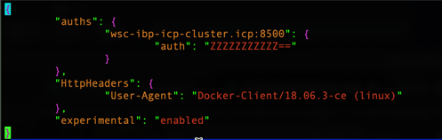
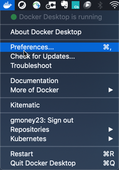
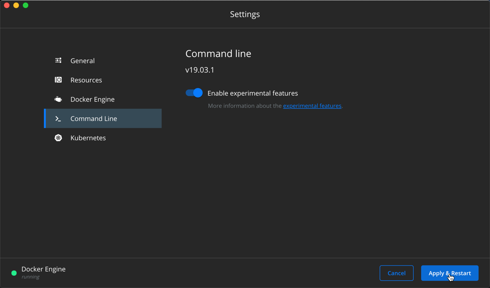
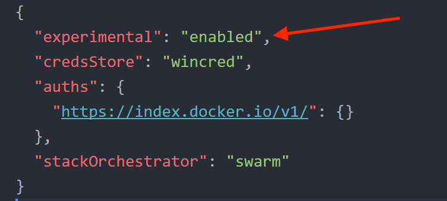
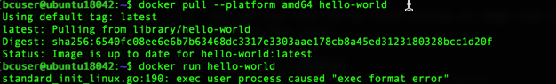
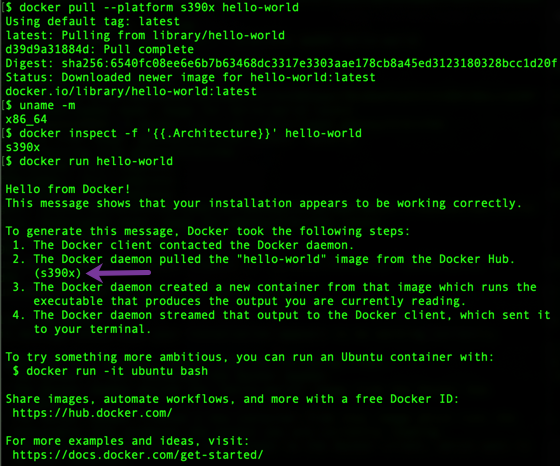

# 4. Bringing Multi-arch Images to a Computer Near You

This section goes through installing the manifest tool and building the multi-arch docker images.

## If Using Proxy
If using proxy, make sure you've read [0-ProxyPSA](0-ProxyPSA.md) and have set your `http_proxy`, `https_proxy`, and `no_proxy` variables for your environment as specified there. Also note that for all docker run commands add the `-e` for each of the proxy environment variables as specified in that 0-ProxyPSA document.

## Enabling Docker Experimental Features
We need to enable experimental features for both the docker client and server in order to use the `docker manifest` command and `--platform` tags respectively. In order to do this please follow the steps below for your operating system. `docker manifest` enables us to push and pull manifest lists while `--platform` gives us the ability to pull images of a specific platform (i.e. operating system/architecture). This lets us pull s390x images even if we are on an amd64 platform which is needed to get the base images for our cross-builds later.

**IMPORTANT: PLEASE USE DOCKER 18.06 or later**

*If you don't have at least this version, please upgrade*



Check with:

```
docker version
```



*Under Client:* If `Experimental: false` like in the above picture then you need to do the *Client* steps. If `Experimental: true` then you can skip the *Client* steps.

*Under Server:* If `Experimental: false` like in the above picture, you need to do the *Server* steps. If `Experimental: true` then you can skip the *Server* steps.

###### Linux
*Client*

```
ls ~/.docker
```

If `~/.docker/config.json` exists:

(Open config.json with your favorite text editor)

```
vim ~/.docker/config.json
```

Add `"experimental": "enabled"` to config.json file



If `~/.docker/config.json` doesn’t exist:

```
mkdir .docker
```

```
echo $'{\n    "experimental": "enabled"\n}' | tee ~/.docker/config.json
```

Add `"experimental": "enabled"` to `config.json` file


*Server*

```
sudo ls /etc/docker
```

If `/etc/docker/daemon.json` exists:

(Open daemon.json with your favorite text editor)

```
sudo vim /etc/docker/daemon.json
```

Add `"experimental": true` to `daemon.json` file

If `/etc/docker/daemon.json` doesn't exist:

```
echo $'{\n    "experimental": true\n}' | sudo tee /etc/docker/daemon.json
```


*Restart Docker to Pick Up Changes*

```
sudo service docker restart
```

Once docker is started, check `docker version` again to see experimental set to true for both client and server:

```
docker version
```


###### Mac
Open the Preferences from the menu



*Client*

Go to `Command Line` and click to Enable experimental features. Then, click `Apply and Restart`.



*Server*

Go to `Docker Engine` and change false to true for experimental. Then, click`Apply & Restart`.


Once docker is started check `docker version` again to see experimental set to true for both client and server:

```
docker version
```


###### Windows
In the Windows file explorer go to your users directory and see if `.docker` exists if so open that directory and edit it with your favorite text editor. Add `"experimental": "enabled"` to the `config.json` file

If it doesn't exist, make a new folder called `.docker` and create a new file called `config.json`. Add "experimental: enabled" inside of brackets.



## Check for Success
In the end check your docker version to see that the change persisted. Specifically, look for client's experimental section being marked `Experimental: True`.

```
docker version
```


## Cross-Architecture Docker 

Normally, one can only run docker images compiled for the host machine's architecture. This means that in order to run an s390x image, you would need an s390x server. Additionally, since building an s390x image (in most cases) requires running s390x binaries on your system, this also requires an s390x server. The same holds true for arm, x86 (amd64), power (ppc64le), etc. This limits the ability to build images that are available across all platforms. One way to overcome this limitation is by using [binfmt_misc](https://www.kernel.org/doc/html/latest/admin-guide/binfmt-misc.html) in conjunction with [qemu](https://www.qemu.org/) (quick emulation) running using [user-mode-emulation](https://ownyourbits.com/2018/06/13/transparently-running-binaries-from-any-architecture-in-linux-with-qemu-and-binfmt_misc/). Qemu dynamically translates the target architecture's instructions to the the host architecture's instruction set to enable binaries of a different architecture to run on a host system. [Binfmt_misc](https://lwn.net/Articles/679308/) comes in to enable the kernel to read the foreign architecture binary by ["directing"](https://lwn.net/Articles/679308/) the kernel to the correct qemu static binary to interpret the code.

In order to set this up to work with Docker and its underlying linux kernel, we first need:

1. binfmt_misc to register the corresponding qemu-static binary for each architecture that has a static qemu image available [of course other than the native one].

2. provide these qemu-static binaries to the system for the host architecture to all of the target architectures. *You can get these by building them from the qemu code or from a package of qemu for your os. To get the most recent ones, it is best to build from source at a stable version of the code*

3. load the static immediately so it is in place to be used with Docker for each container it creates in their new sets of namespaces [read: use `F flag` for binfmt_misc setup]

### Setting up Cross-Architecture support

The [docker/binfmt](https://github.com/docker/binfmt) github project creates a docker image which completes all 3 tasks.

Their implementation works for an amd64 host, so I made a separate image with the qemu-static binaries compiled from the s390x host and posted a multi-arch image for both amd64 and s390x hosts to `gmoney23/binfmt`.

You can test this out by first running an image that is from a different platform than yours. 

##### Linux

```
docker pull --platform amd64 hello-world
```

```
docker run hello-world
```

You should get an exec format error like so:


Now, run the docker image to perform the aforementioned required 3 steps on either s390x of amd64:

```
docker run --rm --privileged gmoney23/binfmt
```

`--privileged` gives the container the necessary permissions it requires. The script within this container registers qemu `linux-user` binaries with binfmt_misc. (These binaries are statically compiled on the host architecture for each supported target architecture. In our case: s390x, arm, and ppc64le on amd64 and arm, amd64, and ppc64le on s390x). These binaries are generated during container build and are found within the `gmoney23/binfmt` container. They are registered with the [F (fixed) flag](https://lwn.net/Articles/679308/) which opens the static binary as soon as it is installed so that spawned containers can use the qemu static. This support was added to the linux kernel to enable things such as the cross-building we are going to do. (The full options are `OCF` and you can see the full description for each option [here](https://www.kernel.org/doc/Documentation/admin-guide/binfmt-misc.rst))

Confirm the architecture with: 

```
uname -m
```

Confirm the image architecture with: 

```
docker inspect -f '{{.Architecture}}' hello-world
```

Finally, run the image successfully with the same command as before: 

```
docker run hello-world
```


We can also see in the `hello-world` output the `amd64` architecture mentioned. Thus we have achieved our goal of running amd64 (x86) images on `s390x`.

##### Mac / Windows
Docker for Mac and Docker for Windows have this capability built-in out of the box so we don't even have to set it up with an image run. However, don't just take my word for it, demonstrate it to yourself by trying the `s390x` (z) image for `hello-world` on your `amd64` (x86) mac:

```
docker pull --platform s390x hello-world
```

Confirm the architecture with: 

```
uname -m
```

Confirm the image architecture with: 

```
docker inspect -f '{{.Architecture}}' hello-world
```

Finally, run the image successfully the 1st try with: 

```
docker run hello-world
```



This works successfully (without additional configuration needed) 

**What do you mean by this capability is built-in out of the box?**

Docker for Mac and Docker for Windows run containers in a vm (either a hypervisor of hyperkit on mac [a derivative of xhyve] or hyper-v on windows) which it uses to run a linux kernel that in this case is set up with binfmt_misc which is used to emulate the other architectures by setting up a file system with a static arch interpreter (a qemu linux-user static file for the given arch). The setup we did for linux, the Docker install does for us on mac/windows as part of the setup for that environment. Meanwhile, since we already have a linux kernel with docker for linux, we get the privilege of making our own changes to it for now. If this brief talk about Docker for Mac internals piqued your interest, I highly encourage [Under the Hood: Demystifying Docker For Mac CE Edition](http://collabnix.com/how-docker-for-mac-works-under-the-hood/)

The ease of running and building multi-arch on mac and windows fills us with determination ...

### Consequences of Cross-Architecture Docker

This enables us to not only run images, but also build them for different architectures from a given host architecture. This makes it possible to build s390x (z), power (ppc64le), arm, and amd64 images all from the hosts you have available. This enables developers to support more images as they may have nodes with only specific architectures such as `amd64`. Using this technology, suddenly ecosystem contribution is no longer constrained by host architecture limitations, creating a broader docker image ecosystem for everyone. In fact, with the current stable docker CE build and onward  [buildx](https://github.com/docker/buildx) comes as an experimental future to build and push multi-arch images (using qemu behind the scenes) in a seamless process which we will briefly explore in a recommended optional follow-up to this section (given you have a workstation with Docker CE of version 19.0.3 or later). 

The big caveat to this capability remains that qemu does not support all instructions and is being constantly improved to handle more exceptions and work for more use cases in the future. What is supported will be dictated by which linux-user static binary you are using with arm and s390x having more support than ppc64le at the current time (at least for nodejs). This means for certain image builds you will still have to use the native hardware, but for many images qemu provides a quick and easy way to build images for more platforms. 

Next, we will use an amd64 host to build images for both architectures and use them to make multi-arch images that support both architectures for each of the applications we have visited in parts 2 and 3 of this tutorial.

*Note: amd64 linux-user does not have the capability required for these images at this time (i.e. running npm install) which is why the host needs to be amd64 if we want to include an amd64 image. This is largely in part to lack of need to emulate amd64 due to its wide availability and most personal workstations using amd64 architecture.*

## Making multi-arch docker images

In order to build all of the images for both amd64 (x86) and s390x (z) architectures, we will use a simple script that I wrote to go through the steps of building each individual architecture image with both a versioned and latest tag. Then, it creates a manifest list for each application and pushes it up to form a multiarch image for each of the applications we have gone over. It is heavily commented so it should explain itself.


If you want to visit the script itself you can open in it a new tab by right-clicking on: 

[Build and Push Images Script](https://github.com/siler23/MultiArchDockerICP/blob/master/Build_And_Push_Images.sh)

### Login to your Docker Repo [Account]

Set `DOCKER_REPO=<docker_username>` which for me is:

```
DOCKER_REPO=gmoney23
```

Set yours accordingly, then do a docker login:

```
docker login -u ${DOCKER_REPO}
```

Enter your password when prompted:


### Run Script to build and Push Images

#### Without Proxy

The options are as follows:

```
DOCKER_REPO=<my_docker_repo> VERSION=<version_number> IMAGE_PREPEND=<prepend_to_make_unique_image> LATEST=<true_or_false> ./Build_And_Push_Images.sh
```

Sample Command with my docker repo of `gmoney23` please replace with your docker repo (the one you used for `docker login` above):

```
DOCKER_REPO=gmoney23
```

```
DOCKER_REPO=${DOCKER_REPO} VERSION=1.0 IMAGE_PREPEND=marchdockerlab LATEST=true ./Build_And_Push_Images.sh
```

#### With Proxy

The options are as follows:

```
DOCKER_REPO=<my_docker_repo> VERSION=<version_number> IMAGE_PREPEND=<prepend_to_make_unique_image> LATEST=<true_or_false> http_proxy=<proxy_for_http_protocol> https_proxy=<proxy_for_https_protocol> no_proxy=<addresses_not_to_be_proxied> ./Build_And_Push_Images.sh
```

Sample Command with my docker repo of `gmoney23` please replace with your docker repo (the one you used for `docker login` above):

```
DOCKER_REPO=gmoney23
```

```
DOCKER_REPO=${DOCKER_REPO} VERSION=1.0 IMAGE_PREPEND=marchdockerlab LATEST=true http_proxy=http://myproxy:8080 https_proxy=http://myproxy:8080 no_proxy="localhost, 127.0.0.1" ./Build_And_Push_Images.sh
```

Hearing about qemu fills us with determination ...

## OPTIONAL SECTIONS

### Recommended: [Most users should try if they have docker 19.03 CE or later]: [The future - Using Buildx to make Multi-arch a Way of Life](4-Multiarch-buildx-addendum.md)

### Extra Content: [Most Users Should Skip]: [The past - The Manual Way aka Herding Cats](4-Multiarch-manual-addendum.md)

**This optional path is a manual collection of tasks to build images in more depth if you want more detail. This is purely for educational purposes if something in the script didn't make sense or you want further material and not part of the main path.**

# [Part 5: Kubernetes Time](5-Deploy-to-Kubernetes.md)