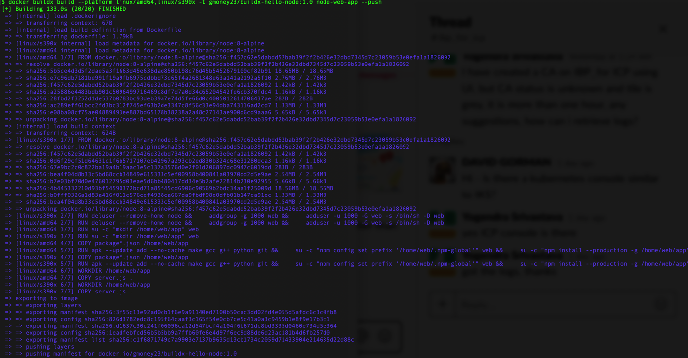

# The future - Using Buildx to make Multi-arch a Way of Life

## If Using Proxy
If using proxy, make sure you've read [0-ProxyPSA](0-ProxyPSA.md) and have set your `http_proxy`, `https_proxy`, and `no_proxy` variables for your environment as specified there. Also note that for all docker run commands add the `-e` for each of the proxy environment variables as specified in that 0-ProxyPSA document.

## Buildx: Seamless multi-arch builds are in your future

Buildx [https://github.com/docker/buildx] has become a part of stable Docker builds with `Docker CE 19.03` as an experimental feature. 

Since we have already enabled experimental features (if our docker version is 19.03 or greater) [if you don't remember run `docker version`], we are ready to use buildx. We have already built our images above using a script. Let's see what the future holds...

### Setup Buildx

First, we will create a new builder:
```
 docker buildx create --name multi-arch
```
Next, we will set this to our active builder:
```
docker buildx use multi-arch
```
Then, we will bootstrap it. At this point it will look for the supported architectures on our system using qemu and list them for us.
```
docker buildx inspect --bootstrap
```
Finally, we can see our current builders with
```
docker buildx ls
```

Here is how this all looks from my mac:


Notice, that the 2 architectures we want to use (s390x and amd64) are both supported on my system. This is because the qemu emulation is set up for s390x, arm (multiple versions), and ppc64le and my host platform is amd64 (in this case). This will work on any machine once its set up: either out-of-the-box with docker desktop for mac or windows or after you enable qemu on your linux box like we did above with the `gmoney23/binfmt` image.

### Login to our Docker Repo

Set `DOCKER_REPO=<docker_username>` which for me is:

```
DOCKER_REPO=gmoney23
```

Set yours accordingly, then do a docker login:

```
docker login -u ${DOCKER_REPO}
```

### Use Buildx to create multi-arch images

Now, we can create a multi-architecture image for the three (x, z, and power) architectures (and more if desired) in one command:

```
docker buildx build --platform linux/amd64,linux/s390x,linux/ppc64le -t ${DOCKER_REPO}/buildx-hello-node:1.0 "${MULTIARCH_HOME}"/node-web-app --push
```

*Note: We are using the DOCKER_REPO we just logged in to with the environment variable we just set above*



We can look at our newly pushed image to verify with:

```
docker run mplatform/mquery ${DOCKER_REPO}/buildx-hello-node:1.0
```


To see the full manifest list we can inspect it with
```
docker manifest inspect ${DOCKER_REPO}/buildx-hello-node:1.0
```


Buildx isn't just limited to multi-arch builds with statics, it can also register remote builders to build images on those machines. Again, if you want to check it out see the [buildx github](https://github.com/docker/buildx). Also, if you want to see a walk-through on buildx with arm see [Building Multi-Arch Images for Arm and x86 with Docker Desktop](https://engineering.docker.com/2019/04/multi-arch-images/).

We can use buildx to simplify the multi-arch process even further by bringing our build pipeline together in one place and allowing us to concurrently construct images for all arches that we can use in our manifest lists to "create" multi-arch images in one command.

Now, it's time to use the multi-arch images in Kubernetes!

## OPTIONAL SECTION

### Extra Content: [Most Users Should Skip]: [The past - The Manual Way aka Herding Cats](4-Multiarch-manual-addendum.md)

**This optional path is a manual collection of tasks to build images in more depth if you want more detail. This is purely for educational purposes if something in the script didn't make sense or you want further material and not part of the main path.**

The knowledge that you can build and push multiarch images with one command is splendid, it fills you with [determination](https://undertale.fandom.com/wiki/Determination)

# [Part 5: Kubernetes Time](5-Deploy-to-Kubernetes.md)
