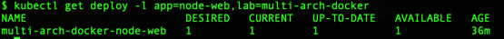
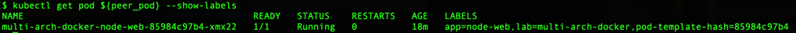
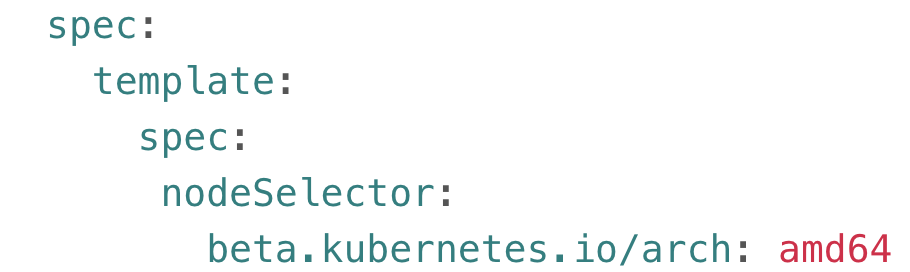
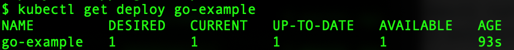
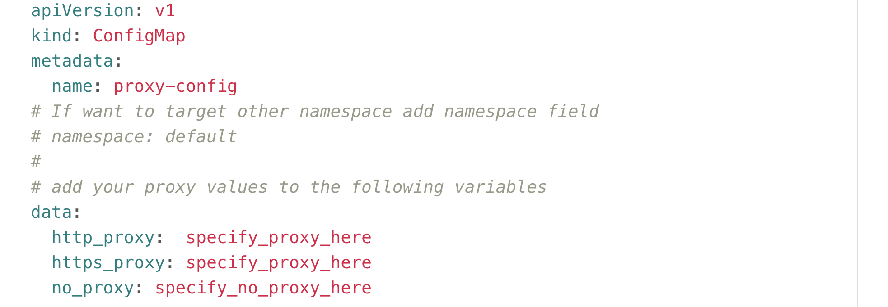
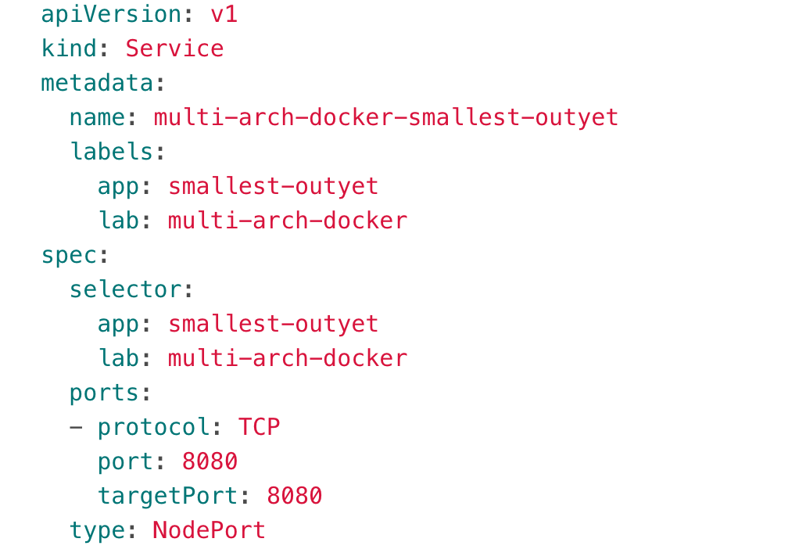
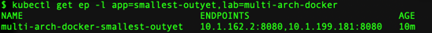
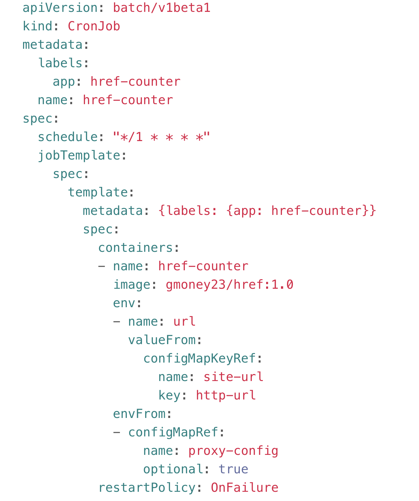

# 5. Kubernetes Time
We will use the multi-arch docker images we have created to make deployments that will run across s390x and amd64 nodes as well as force pods to go to either s390x or amd64 nodes. We will cover the use of deployments, services, configmaps, jobs, and cronjobs including how to easily declare a proxy to your application.

## If you are starting to lose your determination


The inspiring picture fills you with [determination](https://undertale.fandom.com/wiki/Determination).

## If Using Proxy
If using proxy, make sure you've read [0-ProxyPSA](0-ProxyPSA.md) and have set your `http_proxy`, `https_proxy`, and `no_proxy` variables for your environment as specified there. Also note that for all docker run commands add the `-e` for each of the proxy environment variables as specified in that 0-ProxyPSA document.

## Running on windows [Mac/Linux Users Skip This]
The commands listed are bash commands. In order to use bash on Windows 10 see [Enabling Bash on PC](https://www.lifewire.com/how-to-run-the-bash-command-line-in-windows-10-4072207). If you do that, all of the commands below will work in a bash script for you. If you don't want to do that you can also use the command prompt. Just replace the `$var` with `%var%` and `var=x` with `set var=x`. The kubectl commands themselves are the same across operating systems. An example is changing the bash command:

```
peer_pod="$(kubectl get pods -l app=node-web,lab=multi-arch-docker -o jsonpath='{.items[*].metadata.name}')"
```

 to the Windows command:

```
kubectl get pods -l app=node-web,lab=multi-arch-docker -o jsonpath='{.items[*].metadata.name}'
```

```
set peer_pod=result
``` 

where result is the output of the previous command

and when referencing it change bash:

```
kubectl exec $peer_pod -- ash -c "uname -m"
```

(bash)

to Windows:

```
kubectl exec %peer_pod% -- ash -c "uname -m"
```

(Windows)

Again, you'll notice the kubectl command is exactly the same. We are just changing the variable use reference in bash to command prompt style. Also that `$()` was a bash way to run the command its in own shell and feed the output to our command so I broke the command into two for windows instead.

## Before we begin, allow Images from my repo to the cluster [Admin Only]

let's edit the [clusterimagepolicy](https://www.ibm.com/support/knowledgecenter/en/SSBS6K_3.1.0/manage_images/image_security.html) to allow pulls from the `gmoney23` directory for this guide. This policy prevents users from pulling images from any repository for security since some repositories could potentially hold dangerous images.

### [Skip if not admin]

```
kubectl edit clusterimagepolicy public-docker-image-policy
```

add the following line:

```
- name: docker.io/gmoney23/*
```

If you pulled all the images yourself, you could also use these instead, you would just need to update the yaml files to reference the name images from your repository and add that image to your cluster instead.

## Let's create our first Deployment using our node-web-app

Make sure you are in the main directory of the github project.

Create the deployment with:

```
kubectl apply -f node-web-app/deployment.yaml
```

You can think of the [deployment](https://kubernetes.io/docs/concepts/workloads/controllers/deployment/) as deploying all of the parts needed to manage your running application. The deployment itself manages updates and configuration of your application. It creates a [ReplicaSet](https://kubernetes.io/docs/concepts/workloads/controllers/replicaset/) that manages the number of replicas [pods] that are up at a time for a given application with a control loop. A [pod](https://kubernetes.io/docs/concepts/workloads/pods/pod-overview/) is the smallest unit in Kubernetes and is made up of all the containers in a given deployment (application) that have to be scheduled on the same node. Now, let's use a label to determine one pod that belongs to your deployment.

Then:

```
peer_pod="$(kubectl get pods -l app=node-web,lab=multi-arch-docker -o jsonpath='{.items[*].metadata.name}')"
```
### A note about jsonpath

You may have noticed the `-o jsonpath='{.items[*].metadata.name}')` in the previous example. Kubernetes has [jsonpath](https://restfulapi.net/json-jsonpath/) capability built-in. Jsonpath is a query language that lets us extract the bits of a json document, in this case the bits of the Kubernetes json document (found with `kubectl get pods $peer_pod -o json`), to get the information we need. This enables us to easily find up to date information about the objects in our cluster and allows us to use this information to make automation scripts among other things. In this example, we are finding the name of our pod in an automated way.

### A note about labels

We used a [selector](https://kubernetes.io/docs/concepts/overview/working-with-objects/labels/#label-selectors) to select a pod with a specific set of labels. We can also do this with other objects that have labels such as deployments with:

```
kubectl get deploy -l app=node-web,lab=multi-arch-docker -o jsonpath={.items}
```



[Labels](https://kubernetes.io/docs/concepts/overview/working-with-objects/labels/) are key-value pairs attached to objects to specify certain qualities and enable users and controllers to select objects based on these qualities. For example, we can attach a label to a pod such as lab and look for pods that have that label to see all pods that are part of a lab. Furthermore, we can look at the value of the label and see all pods labeled for a specific lab such as `multi-arch-docker`. The replicaSets and deployments introduced above use labels to keep track of which objects they are controlling and services (which we'll dive into later) use selectors of certain labels to see to which pods they should route traffic.

In order to see all the labels on a specific object we can use the `--show-labels` option such as:

```
kubectl get pod ${peer_pod} --show-labels
```



### Changing Architectures

Since the node-web-app has a base image with ash, we can run ash on this pod to find out the architecture of the node it's running on:

```
kubectl exec $peer_pod -- ash -c "uname -m"
```

Depending on if it's currently running on x86 or s390x, we can force it to run on the other with a [nodeSelector](https://kubernetes.io/docs/concepts/configuration/assign-pod-node/). (We could also force it to stay on that arch, but that's no fun). A `nodeSelector` is a special label which needs to be satisfied for a pod to be assigned to a node. The `nodeSelector` `beta.kubernetes.io/arch:` is for deploying pods on a node with the specified architecture. (i.e. specify z with `beta.kubernetes.io/arch: s390x`)

Hopefully, you are still in the main github directory.

#### If it's running on x86 now, force z

```
deployment=$(kubectl get deploy -l app=node-web,lab=multi-arch-docker -o jsonpath='{.items[*].metadata.name}')
```

```
 kubectl patch deployment $deployment --patch "$(cat zNodeSelector.yaml)"
```

The file itself just includes the necessary nodeSelector with the correct number of {} for json placement 

Now, a new pod will be created on the target architecture. Thus, first we will get our pod name and then check it's architecture again.
```
peer_pod="$(kubectl get pods -l app=node-web,lab=multi-arch-docker -o jsonpath='{.items[0].metadata.name}')"
```

confirm the architecture changed with:
 
```
kubectl exec $peer_pod -- ash -c "uname -m"
```

#### If it's running on z, force x86

```
deployment=$(kubectl get deploy -l app=node-web,lab=multi-arch-docker -o jsonpath='{.items[*].metadata.name}')
```

```
kubectl patch deployment $deployment --patch "$(cat xNodeSelector.yaml)"
```

from main MultiArchDockerICP directory. The file itself just includes the necessary nodeSelector with the correct number of {} for json placement 

Now, a new pod will be created on the target architecture. Thus, first we will get our pod name and then check it's architecture again.
```
peer_pod="$(kubectl get pods -l app=node-web,lab=multi-arch-docker -o jsonpath='{.items[0].metadata.name}')"
```

confirm the architecture changed with:
 
```
kubectl exec $peer_pod -- ash -c "uname -m"
```

#### Overview of NodeSelector (What did we just do?)

The `nodeSelector` element can be very useful when working with multiple architectures because in certain cases you only want your workload to go on one architecture of your multi-architecture cluster. For example, you may want a database to run without the need for sharding on LinuxONE and a deep learning workload to run on x86. This is one of the ways you can tell your cluster to do that. To see all the ways to assign pods to nodes look at [Assigning Pods to Nodes](https://kubernetes.io/docs/concepts/configuration/assign-pod-node/)

### Viewing our Nodejs Web application in Kubernetes

#### Create a Service to talk to the Outside World

A [service](https://kubernetes.io/docs/concepts/services-networking/service/) exposes our application to traffic from both inside the cluster and to the outside world depending on the [service type](https://kubernetes.io/docs/concepts/services-networking/service/#publishing-services-service-types).

In order to create the service for our node-web-app we will apply the yaml files as before using:

```
kubectl apply -f node-web-app/service.yaml
```

`service/multi-arch-docker-node-web created`

Then, we can get the address our service exposed by first finding our service using label selectors again with the command:

```
service=$(kubectl get svc -l app=node-web,lab=multi-arch-docker -o jsonpath='{.items[0].metadata.name}')
```

Now we can find the external address the service exposed for us.

##### Admin can run this command or check the console for the Proxy IP

```
CLUSTERIP=$(kubectl get nodes -o jsonpath="{.items[0].status.addresses[0].address}"
```

##### Non-admin Needs to get the IP from Admin

```
CLUSTERIP=<your_proxyip>
```

#### Visit Node Web App

```
NODEPORT=$(kubectl get svc $service -o jsonpath='{.spec.ports[0].nodePort}')
```

Then, we can visit the app at

```
echo $CLUSTERIP:$NODEPORT
```

in our browser

A NodePort opens up all externally accessible nodes in the cluster at a fixed port. This is a little messy in practice, but good for demos, etc. because of its ease.

After visiting our app, we can delete it and our service with:

```
kubectl delete -f node-web-app/deployment.yaml
```

`deployment.extensions "multi-arch-docker-node-web" deleted`

```
kubectl delete -f node-web-app/service.yaml
```

`service "multi-arch-docker-node-web" deleted`

## Let's create our first Go Deployment
We'll use the example-go-server image and some quick kubectl one-line commands to spin things up. The advantage of these is that it is easy to get things running. However, your configuration isn't automatically saved and configured, which is why managing with `.yaml` files in production is preferred.

### Make a Quick Deployment

```
kubectl run go-example --image=gmoney23/example-go-server --port 5000 --image-pull-policy=Always
```

`kubectl run --generator=deployment/apps.v1beta1 is DEPRECATED and will be removed in a future version. Use kubectl create instead.`

`deployment.apps/go-example created`

```
kubectl get deploy go-example
```



### Expose the Deployment to the Outside World

This deployment is available. However, I can't access it from nodes outside of my cluster which is no good for a web app, so lets expose it to external connections by adding a nodePort service

```
kubectl expose deployment go-example --type=NodePort
```

```
kubectl get svc go-example
```


Now if I go to my `$CLUSTERIP:32532` as specified in port I can see my app running. You will probably see a different one for yours, so go to that one.

Now I can save the deployment and service I created to a file with --export.

```
kubectl get deployment go-example -o yaml --export > go-example-deployment.yaml
```

```
kubectl get svc go-example -o yaml --export > go-example-svc.yaml
```

### Find the Node Hosting my Pod

Since this pod doesn't have a bash shell since it was made from scratch I'll use kubectl get pods -o wide to figure out which node it is running on. We should know which architecture each host node is or could get that from our cluster admin.

```
kubectl get pods -l run=go-example -o wide
```


### Clean Up Sample Go Deployment

We can delete the deployment and service by using `kubectl delete resource name` such as `kubectl delete deployment deployment_name`. For our sample go deployment this means:

```
kubectl delete deployment go-example
```

```
kubectl delete service go-example
```

## Deal with Proxies with a ConfigMap
In our first 2 deployments, our apps were confined within our own premises, not requiring any calls to the outside world. However, in many cases, an app will need to make calls to the outside world for things like live updates and information from web sites. Soon, our `outyet` deployment will need to check the golang git page to see if version 1.11 of go has been released. Later, our `href` application will need to call out to websites to check their internal and external hrefs. Many applications require this functionality and many corporations have proxies that prevent apps running in containers from making these calls natively. In order to achieve this functionality, we will be using ConfigMaps. A [configmap](https://kubernetes.io/docs/tasks/configure-pod-container/configure-pod-configmap/) enables us to specify our configuration values in one place, where they can be referenced by an application. This way if a user needs different values for something such as a proxy, they can be changed in one place instead of digging into the application. Here is our proxy ConfigMap: 



##### Regular Users
If a user doesn't need a proxy they can just not apply this ConfigMap since we will make it `optional` in the deployment.

##### Proxy users
***Only if you use a proxy***, please put your proxy values here and apply this ConfigMap with:

```
kubectl apply -f proxy-configmap.yaml
```

from the main github project directory of your clone.

## Explore how to create deployments and services from yaml
Here we will explore a sample deployment file to use in our cluster.

### Time to Deploy YAML


This deployment attaches a label of small-outyet to identify it and selects pods with that same label running the `gmoney23/smallest-outyet:1.0` image. The port (as we learned before with docker) is 8080 for the outyet family of applications. Additionally, the deployment references the configMap we previously created to deal with proxies. The `envFrom` means that all of the variables from the configMap will be deployed. The configMapRef marked as `optional: true` means that if you don't have a proxy and thus didn't apply the referenced configMap, you are not affected at all. This allows us to make an application that works for both proxy and regular users. Finally, the `imagePullPolicy` marked as `Always` means that we will check for a new version of the image every time we run a container from it. The default is that this happens for an image marked latest/no tag because that image is frequently updated with new versions. The default for images tagged with a version number is to only pull the image `IfNotPresent` which means if it is not on the machine. This is because usually a versioned release is updated with a new version rather than updating that same versioned image. If that's not the case, we can specify a different imagePullPolicy for those images like we do here with `Always` which overrides the default. If your image lies in a private repository, we can also add a secret to reference it without having to `docker login` to the repository first. See [Pulling an image from a private registry](https://kubernetes.io/docs/tasks/configure-pod-container/pull-image-private-registry/). This can be important in Kubernetes, when many times the user should  not have direct access to the host server and you want to be able to pull from a private registry with authentication. That was a mouthful ... Now, we can simply apply this file to create the deployment.

### Time to Service YAML

```
kubectl apply -f smallest-outyet/deployment.yaml
```

`deployment.extensions/multi-arch-docker-smallest-outyet created`

Now, to enable us to connect to this app, we need to deploy a service. We will create a yaml file for this as well called `service.yaml`.



This service again uses the `NodePort` type mapping port `8080` as the container port and internal port to connect to the external `NodePort`.
We can apply this to create the service.

```
kubectl apply -f smallest-outyet/service.yaml
```

`service/multi-arch-docker-smallest-outyet created`

We can look at how the service maps to the pod by looking at the endpoints of the service.

```
kubectl get ep -l app=smallest-outyet,lab=multi-arch-docker
```


Now, I can scale the deployment to having 2 replicas instead of 1.

```
deployment=multi-arch-docker-smallest-outyet
```

```
kubectl patch deployment $deployment -p '{"spec": {"replicas": 2}}'
```

Let's look at the endpoints for the service again.

```
kubectl get ep -l app=smallest-outyet,lab=multi-arch-docker
```



We can see the two pods' endpoints using the service instead of the one before.

### Get the Access Info for Outyet

To access the application itself, I can get the IP and `NodePort` using kubectl

#### Admin can run this command or check the console for the Proxy IP
```
CLUSTERIP=$(kubectl get nodes -o jsonpath="{.items[0].status.addresses[0].address}"
```

#### Non-admin Needs to get the IP from Admin
```
CLUSTERIP=<your_proxyip>
```

### Time to See if it's Outyet
```
NODEPORT=$(kubectl get svc -l app=smallest-outyet,lab=multi-arch-docker -o jsonpath='{.items[0].spec.ports[0].nodePort}')
```

```
echo $CLUSTERIP:$NODEPORT
```

I can plug this address into my browser to view the app.


### Clean Up

To clean app I can delete the deployment using the yaml I created it with. The same goes for the service.

```
kubectl delete -f smallest-outyet/deployment.yaml
```

`deployment.extensions "multi-arch-docker-smallest-outyet" deleted`

```
kubectl delete -f smallest-outyet/service.yaml
```

`service "multi-arch-docker-smallest-outyet" deleted`

## New Web App, Similar Steps for Access:

### Small-Outyet Deserves a Chance to Run

```
kubectl apply -f small-outyet/deployment.yaml
```

`deployment.extensions/multi-arch-docker-small-outyet created`

```
kubectl apply -f small-outyet/service.yaml
```

`service/multi-arch-docker-small-outyet created`

```
service=multi-arch-docker-small-outyet
```

```
peer_pod="$(kubectl get pods -l app=small-outyet,lab=multi-arch-docker -o jsonpath='{.items[*].metadata.name}')"
```

#### Admin can run this command or to find out the Proxy IP

```
CLUSTERIP=$(kubectl get nodes -o jsonpath="{.items[0].status.addresses[0].address}"
```

#### Non-admin Needs to get the IP from the Admin

```
CLUSTERIP=<your_proxyip>
```

### It's still out!

```
NODEPORT=$(kubectl get svc $service -o jsonpath='{.spec.ports[0].nodePort}')
```

```
echo $CLUSTERIP:$NODEPORT
```

We can visit this address, to visit our `small-outyet` app.

We can follow similar steps for all of the outyets and example-go-server since they are all webapps with similar constraints.

### Clean up Small-Outyet

```
kubectl delete -f small-outyet/deployment.yaml
```

`deployment.extensions "multi-arch-docker-small-outyet" deleted`

```
kubectl delete -f small-outyet/service.yaml
```

`service "multi-arch-docker-small-outyet" deleted`

## Using Jobs with a CronJob
A [job](https://kubernetes.io/docs/concepts/workloads/controllers/jobs-run-to-completion/) runs a number of pods in order to achieve a given number of successful completions at which point it is done. A [CronJob](https://kubernetes.io/docs/concepts/workloads/controllers/cron-jobs/) runs a job on a time-based schedule. In this example, we will use a cronjob to launch our trusty `href-counter`, every minute. We will then change the environment values sent into href-counter, to get it to switch to a different website and look at its logs to show us the results. Instead of mounting the environment variables directly in the pod we will be using a new [configmap](https://kubernetes.io/docs/tasks/configure-pod-container/configure-pod-configmap/) and the one for proxies we created before to map configuration values to a container instead of hardcoding them in (if applicable)

### First, lets create our ConfigMap
Our configmap.yaml is as follows: 


It simply maps the http-url for us to hit with the href-tool to the site-url configmap with key http-url.
We will be patching this when we want to update our container's environment value. From the main directory of the git repository for this lab let's create our configmap:

```
kubectl apply -f href-counter/configmap.yaml
```

`configmap/multi-arch-docker-site-url created`

Next, we have to make our CronJob. The following yaml will suffice: 



This CronJob schedules a job every minute using href-counter as our label and our image as `gmoney23/href:1.0`. We also use our new `ConfigMap` in the valueFrom field of the `env` field where we specify our `configMapKeyRef` to reference a specific key. Finally, we connect to our proxy `ConfigMap` again since this app makes calls to outside websites. We should be all set. Time to make the cronjob.

```
kubectl apply -f href-counter/cronjob.yaml
```

`cronjob.batch/multi-arch-docker-href-counter created`

After waiting a few minutes, run the logs to see the results:

```
kubectl logs -l app=href-counter,lab=multi-arch-docker
```

`{"internal":5,"external":89}`

`{"internal":5,"external":89}`

`{"internal":5,"external":86}`

Finally, it's time to patch the configmap and see the changes...

```
kubectl patch configmap multi-arch-docker-site-url -p '{"data": {"http-url": "http://google.com"}}'
```

With the configmap patched we should be able to see the changes to the logs of the pods run by the jobs from the CronJob though you might have to wait up to a minute to see a change (*Note: usually only the 3 most recent pods at a given time are available for log reading*):

```
kubectl logs -l app=href-counter,lab=multi-arch-docker
```

`{"internal":5,"external":89}`

`{"internal":5,"external":86}`

`{"internal":8,"external":11}`

Indeed, our values have changed. Our work is complete, time to clean up.

```
kubectl delete -f href-counter/cronjob.yaml
```

`cronjob.batch "multi-arch-docker-href-counter" deleted`

```
kubectl delete -f href-counter/configmap.yaml
```

`configmap "multi-arch-docker-site-url" deleted`

In reality, our `CronJob` could be used to do anything from running the logs at the end of a day, to sending emails to a list of participants weekly, to running health checks on an application every minute to other automated tasks that need to be done every period of time.

If you need more `Kubernetes` skills, cover your bases with [Kubernetes basics](https://kubernetes.io/docs/guides/kubernetes-basics/). Additionally, if you have a hard time figuring out which api to use for a given type look no [further](https://matthewpalmer.net/kubernetes-app-developer/articles/kubernetes-apiversion-definition-guide.html)

## Closing Note

**THAT'S ALL FOLKS!**

*Note to Self: Oops that was off message. I meant to say:*

**Knowing you have a guide as a template for future success fills you with [determination](https://undertale.fandom.com/wiki/Determination).**

*Note to Self: My ability to stay on message and reminisce about [Undertale](https://store.steampowered.com/app/391540/Undertale/) fills me with [determination](https://undertale.fandom.com/wiki/Determination).*

*Note to Self: What will I ever do [next](https://studybreaks.com/tvfilm/deltarune-is-the-sequel-undertale-needs/)*

## Additional Topic
An additional topic to look at after finishing everything here is:
[Building a Helm Chart from Kubernetes yaml files](https://www.ibm.com/blogs/bluemix/2017/10/quick-example-helm-chart-for-kubernetes/)

# [HOME](index.md)