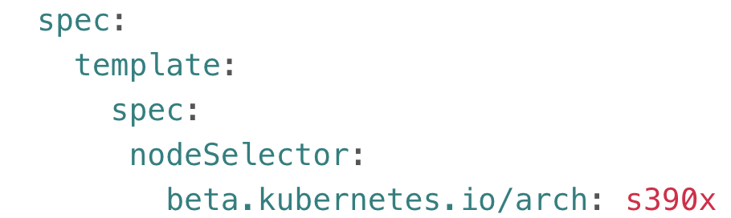
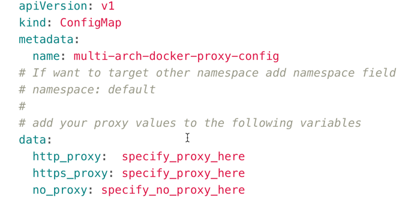
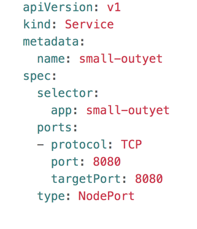
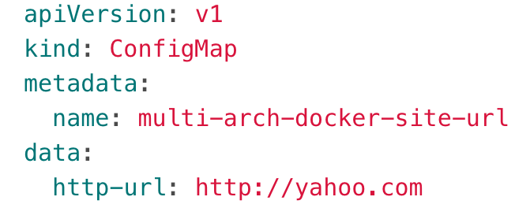
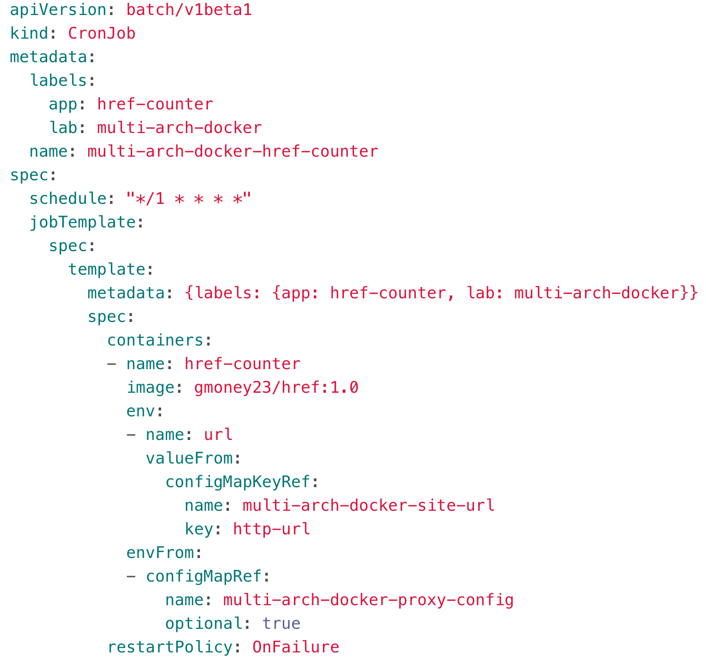

# 5. Kubernetes Time
We will use the multi-arch docker images we have created to make deployments that will run across s390x and amd64 nodes as well as force pods to go to either s390x or amd64 nodes. We will cover the use of deployments, services, configmaps, jobs, and cronjobs including how to easily declare a proxy to your application.

## If Using Proxy
If using proxy, make sure you've read [0-ProxyPSA](0-ProxyPSA.md) and have set your http_proxy, https_proxy, and no_proxy variables for your environment as specified there. Also note that for all docker run commands add the -e for each of the proxy environment variables as specified in that 0-ProxyPSA document.

## Running on windows [Mac/Linux Users Skip This]
The commands listed are bash commands. In order to use bash on Windows 10 see [Enabling Bash on PC](https://www.lifewire.com/how-to-run-the-bash-command-line-in-windows-10-4072207). If you do that, all of the commands below will work in a bash script for you. If you don't want to do that you can also use the command prompt. Just replace the `$var` with `%var%` and `var=x` with `set var=x`. The kubectl commands themselves are the same across operating systems. An example is changing the bash command:

 `peer_pod="$(kubectl get pods -l app=$deployment-selector -o jsonpath='{.items[*].metadata.name}')"`

 to the Windows command:

`kubectl get pods -l app=$deployment-selector -o jsonpath='{.items[*].metadata.name}'`

 `set peer_pod=result` where result is the output of the previous command

 and when referencing it change bash:

  `kubectl exec $peer_pod -- bash -c "uname -m"` (bash)

   `kubectl exec %peer_pod% -- bash -c "uname -m"` (Windows)

 Again, you'll notice the kubectl command is exactly the same. We are just changing the variable use reference in bash to command prompt style. Also that `$()` was a bash way to run the command its in own shell and feed the output to our command so I broke the command into two for windows instead.

## Helm ICP Node.js Sample
If you have an icp instance, please go to the catalog and configure the nodejs-sample chart. 

Whatever you named your deployment (i.e. name), open up the command line and type `deployment=name`(Mac/Linux) or `set deployment=name`(Windows) for whatever name you entered. You can think of the [deployment](https://kubernetes.io/docs/concepts/workloads/controllers/deployment/) as all of the parts of your running application.
Then:

`peer_pod="$(kubectl get pods -l app=$deployment-selector -o jsonpath='{.items[*].metadata.name}')"`.

In this case, we are using a label to determine one pod that belongs to your deployment. A [pod](https://kubernetes.io/docs/concepts/workloads/pods/pod-overview/) is the smallest unit in kubernetes and is made up of all the containers in a given deployment (application) that have to be scheduled on the same node.

**A note about jsonpath**

You may have noticed the `-o jsonpath='{.items[*].metadata.name}')` in the previous example. Kubernetes has [jsonpath] (https://restfulapi.net/json-jsonpath/) capability built-in. Jsonpath is a query language that lets us extract the bits of a json document, in this case the bits of the kubernetes json document (found with `kubectl get pods $peer_pod -o json`), to get the information we need. This enables us to easily find up to date information about the objects in our cluster and allows us to use this information to make automation scripts among other things. In this example, we are finding the name of our pod in an automated way.

Since icp-nodejs-sample has a base image with bash we can run bash on this pod to find out the architecture of the node it's running on:

 `kubectl exec $peer_pod -- bash -c "uname -m"`

Depending on if it's currently running on x86 or s390x, we can force it to run on the other with a [nodeSelector](https://kubernetes.io/docs/concepts/configuration/assign-pod-node/). (We could also force it to stay on that arch, but that's no fun). A nodeSelector is a special label which needs to be satisfied for a pod to be assigned to a node. The nodeSelector beta.kubernetes.io/arch: is for deploying pods on a node with the specified architecture. (i.e. specify z with beta.kubernetes.io/arch: s390x)

If it's running on x86 now, force z with:

 `kubectl patch deployment $deployment --patch "$(cat zNodeSelector.yaml)"` from main MultiArchDockerICP directory.
The file itself just includes the necessary nodeSelector with the correct number of {} for json placement 

If it's running on z, force x86 with:

`kubectl patch deployment $deployment --patch "$(cat zNodeSelector.yaml)"` from main MultiArchDockerICP directory. The file itself just includes the necessary nodeSelector with the correct number of {} for json placement 

`peer_pod="$(kubectl get pods -l app=$deployment-selector -o jsonpath='{.items[*].metadata.name}')"`

confirm the architecture changed with `kubectl exec $peer_pod -- bash -c "uname -m"`

The `nodeSelector` element can be very useful when working with multiple architectures because in certain cases you only want your workload to go on one architecture of your multi-architecture cluster. For example, you may want a database to run without the need for sharding on LinuxONE and a deep learning workload to run on x86. This is one of the ways you can tell your cluster to do that. To see all the ways to assign pods to nodes look at [Assigning Pods to Nodes](https://kubernetes.io/docs/concepts/configuration/assign-pod-node/)

Set environment variables:

`CLUSTERIP=$(kubectl get nodes -o jsonpath="{.items[0].status.addresses[0].address}")`

`NODEPORT=$(kubectl get svc $deployment -o jsonpath='{.spec.ports[0].nodePort}')`

Then, we can visit the app at
echo `$CLUSTERIP:$NODEPORT` in our browser
A nodeport opens up all externally accessible nodes in the cluster at a fixed port. This is a little messy in practice but good for demos, etc. because of its ease.

Now, let's edit the [clusterimagepolicy](https://www.ibm.com/support/knowledgecenter/en/SSBS6K_3.1.0/manage_images/image_security.html) to allow pulls from the `gmoney23` directory for this guide. This policy prevents users from pulling images from any repository for security since some repositories could potentially hold dangerous images.

`kubectl edit clusterimagepolicy public-docker-image-policy`

add the following line:

`- name: docker.io/gmoney23/*`

If you pulled all the images yourself, you could also use these instead, you would just need to update the yaml files to reference the name images from your repository

## Let's create our own first deployment
We'll use the example-go-server image
`kubectl run go-example --image=gmoney23/example-go-server --port 5000 --image-pull-policy=Always`

        deployment.apps/go-example created

`kubectl get deploy go-example`
NAME         DESIRED   CURRENT   UP-TO-DATE   AVAILABLE   AGE
go-example   1         1         1            1           4m

This deployment is available. However, I can't access it from nodes outside of my cluster which is no good for a web app, so lets expose it to external connections by adding a nodePort service

`kubectl expose deployment go-example --type=NodePort`

`kubectl get svc go-example`
NAME         TYPE       CLUSTER-IP   EXTERNAL-IP   PORT(S)          AGE
go-example   NodePort   10.0.0.73    <none>        5000:32532/TCP   32s

Now if I go to my $CLUSTERIP:32532 as specified in port I can see my app running. You will probably see a different one for yours, so get to that one.

Now I can save the deployment and service I created to a file with --export.

`kubectl get deployment go-example -o yaml --export > go-example-deployment.yaml`

`kubectl get svc go-example -o yaml --export > go-example-svc.yaml`

Since this pod doesn't have a bash shell since it was made from scratch I'll use kubectl get node to figure out which architecture the node is.

`peer_pod="$(kubectl get pods -l app=$deployment-selector -o jsonpath='{.items[*].metadata.name}')"`.

I'll find the arch by looking at the nodeInfo on the node where the pod is scheduled using `kubectl get node $(kubectl get pod $peer_pod -o jsonpath='{.spec.nodeName}') -o jsonpath='{.status.nodeInfo.architecture}'`

          amd64
## Deal with Proxies with a ConfigMap
In our first deployment, our app was confined within our premises, not requiring any calls to the outside world. However, in many cases an app will need to make calls to the outside world for things like live updates and information from web sites. Soon, our `outyet` deployment will need to check the golang git page to see if version 1.11 of go has been released. Later, our `href` application will need to call out to websites to check their internal and external hrefs. Many applications require this functionality and many corporations have proxies that prevent apps running in containers from making these calls natively. In order to achieve this functionality, we will be using ConfigMaps. A [configmap](https://kubernetes.io/docs/tasks/configure-pod-container/configure-pod-configmap/) enables us to specifiy our configuration values in one place where they can be referenced by an application. This way if a user needs different values for something such as a proxy they can be changed in one place instead of digging into the application. Here is our proxy ConfigMap: 

##### Regular Users
If a user doesn't need a proxy they can just not apply this ConfigMap since we will make it `optional` in the deployment.

##### Proxy users
***Only if you use a proxy***, please put your proxy values here and apply this ConfigMap with `kubectl apply -f proxy-configmap.yaml` from the main project directory `MultiArchDockerICP`.
## Create deployments and services from yaml
Here we will write a sample deployment file to use in our cluster.

This deployment attaches a label of small-outyet to identify it and selects pods with that same label running the gmoney23/small-outyet:1.0 image. The port as we learned before with docker is 8080 for the outyet application. This references the configMap we previously created to deal with proxies. The `envFrom` means that all of the variables from the configMap will be deployed. The configMapRef marked as `optional: true` means that if you didn't have a proxy and thus didn't apply the referenced configMap, you are not affected at all. This allows us to make an application that works for both proxy and regular users. Finally, the imagePullPolicy marked as `Always` means that we will check for a new version of the image every time we run a container from it. The default is that this happens for an image marked latest/no tag becuase that image is frequently updated with new versions. The default for images tagged with a version number is to only pull the image `IfNotPresent` which means if its not on the machine. This is because usually a versioned release is updated with a new version rather than updating that same versioned image. If that's not the case we can specify a different imagePullPolicy for those images like we do here with `Always` which overrides the defualt. If your image lies in a private repository we can also add a secret to reference it without having to `docker login` to the repository first. See [Pulling an image from a private registry](https://kubernetes.io/docs/tasks/configure-pod-container/pull-image-private-registry/). This can be important in Kubernetes when many times the user should  not have direct access to the host server and you want to be able to pull from a private registry with authentication. That was a mouthful ... Now, we can simply apply this file to create the deployment.

`kubectl apply -f deployment.yaml`

          deployment.extensions/small-outyet created

Now, to enable us to connect to this app we need to deploy a service. We will create a yaml file for this as well called 

This service again uses the NodePort type mapping port 8080 as the container port and internal port to connect to the external nodePort.
We can apply this as well to create the service.
kubectl apply -f service.yaml
service/small-outyet created

We can look at how the service maps to the pod by looking at the endpoints.

`deployment=small-outyet`

`kubectl get ep $deployment`

NAME      ENDPOINTS           AGE
small-outyet    10.1.184.199:8080   39m

Now, I can scale the deployment to having 2 replicas instead of 1.

`kubectl patch deployment $deployment -p '{"spec": {"replicas": 2}}'`

Let's look at the endpoints for the deployment again.
`kubectl get ep $deployment`
`small-outyet    10.1.184.199:8080,10.1.75.224:8080   38m`

Here, we can now see the two pods endpoints using the service instead of the one before.

To access the application itself I can get the IP and NodePort using kubectl

`CLUSTERIP=$(kubectl get nodes -o jsonpath="{.items[0].status.addresses[0].address}")`

`NODEPORT=$(kubectl get svc $deployment -o jsonpath='{.spec.ports[0].nodePort}')`

`echo $CLUSTERIP:$NODEPORT`

I can plug this address into my browser to view the app. To clean app I can delete the deployment using the yaml I created it with. Same goes for the service.

`kubectl delete -f deployment.yaml`

deployment.extensions "small-outyet" deleted

`kubectl delete -f service.yaml`

service "small-outyet" deleted`

For a new app of the same type, I can follow similar steps to access it:

`kubectl apply -f deployment.yaml`

deployment.extensions/smallest-outyet created

`kubectl apply -f service.yaml`

service/smallest-outyet created

`deployment=smallest-outyet`

`peer_pod="$(kubectl get pods -l app=$deployment -o jsonpath='{.items[*].metadata.name}')"`

`CLUSTERIP=$(kubectl get nodes -o jsonpath="{.items[0].status.addresses[0].address}")`

`NODEPORT=$(kubectl get svc $deployment -o jsonpath='{.spec.ports[0].nodePort}')`

`echo $CLUSTERIP:$NODEPORT`

I can do similary for all of the outyets, example-go-server, and node-web-app since they are all webapps with similar constraints.

## Using Jobs with a CronJob
A [job](https://kubernetes.io/docs/concepts/workloads/controllers/jobs-run-to-completion/) runs a number of pods in order to achieve a given number of successful completions at which point it is done. a A [CronJob](https://kubernetes.io/docs/concepts/workloads/controllers/cron-jobs/) runs a job on a time-based schedule. In this example, we will use our trusty href-counter and run a cronjob which will run it repeatedly every minute. We will then change the environment values sent into href-counter to get it to switch to a different website and look at its logs to tell us the results. Instead of mounting the environment variables directly in the pod we will be using a new [configmap](https://kubernetes.io/docs/tasks/configure-pod-container/configure-pod-configmap/) and the one for proxies we created before to map configuration values to a container instead of hardcoding them in.
### First, lets create our ConfigMap
Our configmap.yaml is as follows: 
It simply maps the http-url for us to hit with the href-tool to the site-url configmap with key http-url.
We will be patching this when we want to update our container's environment value. Now, let's create our configmap.

`kubectl apply -f configmap.yaml`

Next, we have to make our CronJob. The following yaml will suffice: 

This CronJob schedules a job every minute using href-counter as our label and our image as gmoney23/href:1.0. We also use our new ConfigMap in the valueFrom field of the `env` field where we specify our configMapKeyRef to reference a specific key. Finally, we connect to our proxy ConfigMap again since this app makes calls to outside websites. We should be all set. Time to make the cronjob.

`kubectl apply -f cronjob.yaml`

After waiting a few minutes, time to patch the configmap and see the changes...

`kubectl patch configmap site-url -p '{"data": {"http-url": "http://google.com"}}'`

With the configmap patched we should be able to see the changes to the logs of the pods run by the jobs from the CronJob.
`kubectl logs -l app=href-counter`

      {"internal":5,"external":89}
      {"internal":5,"external":86}
      {"internal":8,"external":11}

Indeed, our values have changed. Our work is complete, time to clean up.

`kubectl delete -f cronjob.yaml`
cronjob.batch "href-counter" deleted

`kubectl delete -f configmap.yaml`
configmap "site-url" deleted

In reality, our CronJob could be used to do anything from running the logs at the end of a day, to sending emails to a list of participants weekly, to running health checks on an application every minute to other automated taks that need to be done every period of time.

If you need more kubernetes skills, cover your bases with [Kubernetes basics](https://kubernetes.io/docs/guides/kubernetes-basics/). Additionally, if you have a hard time figuring out which api to put for a given type look no [further](https://matthewpalmer.net/kubernetes-app-developer/articles/kubernetes-apiversion-definition-guide.html)

THAT'S ALL FOLKS!

### Additional Topics
Additional topics to look at after finishing everything here are:
1. [Building a Helm Chart from kubernetes yaml files](https://www.ibm.com/blogs/bluemix/2017/10/quick-example-helm-chart-for-kubernetes/)
2. [Cross-building images to build x86 and z images on your local x86 workstation](https://stefanscherer.github.io/cross-build-nodejs-with-docker/) Note: Alpine has been made multi-arch after the posting of the linked article and the base image now runs on s390x/z.

##### [MAIN MENU](../README.md)
