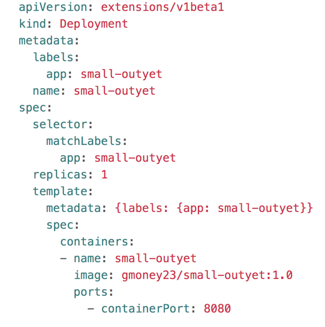

# 5. Kubernetes Time
We will use the multi-arch docker images we have created to make deployments that will run across s390x and amd64 nodes as well as force pods to go to either s390x or amd64 nodes. We will cover the use of deployments, services, configmaps, jobs, and cronjobs.

## Helm ICP Node.js Sample
If you have an icp instance, please go to the catalog and configure the 

Whatever you named your deployment (i.e. name), open up the command line and type `deployment=name` for whatever name you entered. You can think of the [deployment](https://kubernetes.io/docs/concepts/workloads/controllers/deployment/) as all of the parts of your running application.
Then, ```peer_pod="$(kubectl get pods -l app=$deployment-selector -o jsonpath='{.items[*].metadata.name}')"```. In this case, we are using a label to determine one pod that belongs to your deployment. A [pod](https://kubernetes.io/docs/concepts/workloads/pods/pod-overview/) is the smallest unit in kubernetes and is made up of all the containers that have to be scheduled on the same node for a given deployment (application). Since icp-nodejs-sample has a base image with bash we can run bash on this pod to find out the architecture of the node it's running on `kubectl exec $peer_pod -- bash -c "uname -m"`.

Depending on if it's currently running on x86 or s390x, we can force it to run on the other with a [nodeSelector](https://kubernetes.io/docs/concepts/configuration/assign-pod-node/). (We could also force it to stay on that arch but that's no fun). A nodeSelector is a special label which needs to be satisfied for a pod to be assigned to a node. One nodeSelector (beta.kubernetes.io/arch: ) is for only deploying pods on a node with given architecture.

If it's running on x86 now, force z with ```kubectl patch deployment $deployment --patch "$(cat zNodeSelector.yaml)"``` from main MultiArchDockerICP directory

If it's running on z, force x86 with ```peer_pod="$(kubectl get pods -l app=$deployment-selector -o jsonpath='{.items[*].metadata.name}')"```

confirm the architecture changed with kubectl exec $peer_pod -- bash -c "uname -m"

Set environment variables
`CLUSTERIP=$(kubectl get nodes -o jsonpath="{.items[0].status.addresses[0].address}")`
`NODEPORT=$(kubectl get svc $deployment -o jsonpath='{.spec.ports[0].nodePort}')`
Then, we can visit the app at
echo `$CLUSTERIP:$NODEPORT` in our browser
A nodeport opens up all externally accessible nodes in the cluster at a fixed port. This is a little messy in practice but good for demos, etc. because of its ease.

Now, let's edit the clusterimagepolicy to allow pulls from the gmoney23 directory from this demo.
`kubectl edit clusterimagepolicy public-docker-image-policy`
add the following line:
`- name: docker.io/gmoney23/*`

If you pulled all the images yourself, you could also use these instead, you would just need to update the yaml files to reference the name images from your repository


## Let's create our own first deployment
We'll use the example-go-server image
`kubectl run go-example --image=gmoney23/example-go-server --port 5000 --image-pull-policy=Always`

        deployment.apps/go-example created

`kubectl get deploy go-example`
NAME         DESIRED   CURRENT   UP-TO-DATE   AVAILABLE   AGE
go-example   1         1         1            1           4m

This deployment is available. However I can't access it from nodes outside of my cluster which is no good for a web app, so lets expose it to external connections by adding a nodePort service
`kubectl expose deployment go-example --type=NodePort`

`kubectl get svc go-example`
NAME         TYPE       CLUSTER-IP   EXTERNAL-IP   PORT(S)          AGE
go-example   NodePort   10.0.0.73    <none>        5000:32532/TCP   32s

Now if I go to my ingress IP:32532 as specified in port I can see my app running

Now I can save the deployment and service I created to a file with --export.

`kubectl get deployment go-example -o yaml --export > go-example-deployment.yaml`
`kubectl get svc go-example -o yaml --export > go-example-svc.yaml`

Since this pod doesn't have a bash shell since it was made from scratch I'll use kubectl get node to figure out which architecture the node is.

kubectl get node $(kubectl get pod $peer_pod -o jsonpath='{.spec.nodeName}') --show-labels

I'll find the arch by looking for beta.kubernetes.io/arch= tag

## Create deployments and services from yaml
Here we will write a sample deployment file to use in our cluster. 
This deployment attaches a label of small-outyet to identify it and selects pods with that same label running the gmoney23/small-outyet:1.0 image. The port as we learned before with docker is 8080 for the outyet application. Now, we can apply this file to create the deployment.

`kubectl apply -f deployment.yaml`

          deployment.extensions/small-outyet created

Now, to enable us to connect to this app we need to deploy a service. We will create a yaml file for this as well called 

This service again uses the NodePort type mapping port 8080 as the container port and internal port to connect to the external nodePort.
We can apply this as well to create the service.
kubectl apply -f service.yaml
service/small-outyet created

We can look at how the service maps to the pod by looking at the endpoints.

`deployment=small-outyet`
`kubectl get ep $deployment`

NAME      ENDPOINTS           AGE
small-outyet    10.1.184.199:8080   39m

Now, I can scale the deployment to having 2 replicas instead of 1.
`kubectl patch deployment $deployment -p '{"spec": {"replicas": 2}}'`
Let's look at the endpoints for the deployment again.
`kubectl get ep $deployment`
`small-outyet    10.1.184.199:8080,10.1.75.224:8080   38m`

Here, we can now see the two pods endpoints using the service instead of the one before.

To access the application itself I can get the IP and NodePort using kubectl

```CLUSTERIP=$(kubectl get nodes -o jsonpath="{.items[0].status.addresses[0].address}")
NODEPORT=$(kubectl get svc $deployment -o jsonpath='{.spec.ports[0].nodePort}')
echo $CLUSTERIP:$NODEPORT```

I can plug this address into my browser to view the app. To clean app I can delete the deployment using the yaml I created it with. Same goes for the service.

```kubectl delete -f deployment.yaml
deployment.extensions "small-outyet" deleted
kubectl delete -f service.yaml
service "small-outyet" deleted```

For a new app of the same type, I can follow similar steps to access it:

```kubectl apply -f deployment.yaml
deployment.extensions/smallest-outyet created
kubectl apply -f service.yaml
service/smallest-outyet created
deployment=smallest-outyet
peer_pod="$(kubectl get pods -l app=$deployment -o jsonpath='{.items[*].metadata.name}')"
CLUSTERIP=$(kubectl get nodes -o jsonpath="{.items[0].status.addresses[0].address}")
NODEPORT=$(kubectl get svc $deployment -o jsonpath='{.spec.ports[0].nodePort}')
echo $CLUSTERIP:$NODEPORT```

I can do similary for all of the outyets, example-go-server, and node-web-app since they are all webapps with similar constraints.

## Using Jobs with a CronJob
A [job](https://kubernetes.io/docs/concepts/workloads/controllers/jobs-run-to-completion/) runs a number of pods in order to achieve a given number of successful completions at which point it is done. a A [CronJob](https://kubernetes.io/docs/concepts/workloads/controllers/cron-jobs/) runs a job on a time-based schedule. In this example, we will use our trusty href-counter and run a cronjob which will run it repeatedly every minute. We will then change the environment values sent into href-counter to get it to switch to a different website and look at its logs to tell us the results. Instead of mounting the environment variables directly in the pod we will be using a [configmap](https://kubernetes.io/docs/tasks/configure-pod-container/configure-pod-configmap/) which maps configuration values to a container instead of hardcoding them in.
### First, lets create our ConfigMap
Our configmap.yaml is as follows: 
It simply maps the http-url for us to hit with the href-tool to the site-url configmap with key http-url.
We will be patching this when we want to update our container's environment value. Now, let's create our configmap.
`kubectl apply -f configmap.yaml`

Next, we have to make our CronJob. The following yaml will suffice: 

This CronJob schedules a job every minute using href-counter as our label and our image as gmoney23/href:1.0. We also use our configMap ni the valueFrom field where we specify our configMapKeyRef. We should be all set. Time to make the cronjob.

`kubectl apply -f cronjob.yaml`

After waiting a few minutes, time to patch the configmap and see the changes...

`kubectl patch configmap site-url -p '{"data": {"http-url": "http://google.com"}}'`

With the configmap patched we should be able to see the changes to the logs of the pods run by the jobs from the CronJob.
`kubectl logs -l app=href-counter`

      {"internal":5,"external":89}
      {"internal":5,"external":86}
      {"internal":8,"external":11}

Indeed, our values have changed. Our work is complete, time to clean up.

`kubectl delete -f cronjob.yaml`
cronjob.batch "href-counter" deleted

`kubectl delete -f configmap.yaml`
configmap "site-url" deleted

In reality, our CronJob could be used to do anything from running the logs at the end of a day to sending emails a list of participants weekly to running health checks on an application every minute to other automated taks that need to be done every period of time.

If you need more kubernetes skills, cover your bases [Kubernetes basics](https://kubernetes.io/docs/tutorials/kubernetes-basics/) Additionally, if you have a hard time figuring out which api to put for a given type look no [further](https://matthewpalmer.net/kubernetes-app-developer/articles/kubernetes-apiversion-definition-guide.html)

THAT'S ALL FOLKS!

[MAIN MENU](../README.md)
