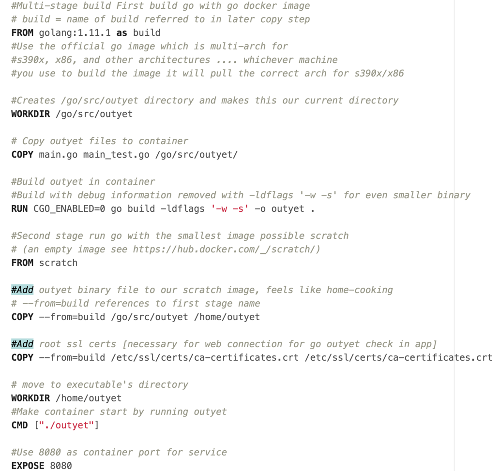
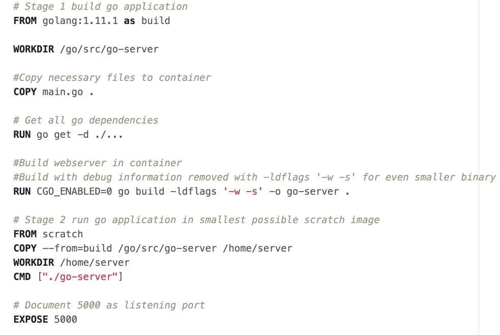

# 3. Making go apps with Docker
We will go over three apps and show how to optimize our go code for docker
1. Go example Outyet program
2. Go Hello world
3. Go href-counter

###But first...Download go for later
Here is the [Go download](https://golang.org/dl/) if you want to run it locally to familiarize yourslef with it/develop with it. For this section, you actually don't need golang installed on your computer because of the magic of docker. However, you may need it sooner than you'd expect: nudge, nudge, wink, wink => *translation: section 5 of this tutorial*

## Outyet
Outyet is a go example program from [Go Outyet Example](https://github.com/golang/example/tree/master/outyet). This app checks if the version of Go specified (in our case 1.11 is outyet) Since we are using it, it better be! We will be dockerizing this app, shrinking our image down on the way over 3 iterations.
### Iteration 1: Outyet
In this first iteration we make the go app in a container and get it running. Since there is a large base image needed for compiling the application and a large os is used for that image, this will be a rather large container. From folder `MultiArchDockerICP` go to outyet and open its Dockerfile. Read the comments for details about the Dockerfile.

Run it with `docker run --rm -p 3000:8080 gmoney23/outyet` and go to `localhost:3000` in web browser to see it.

To check it's size I ran `docker images | grep outyet`
and get a whopping 687 Mb, no room for dessert :(
gmoney23/outyet              latest              11e2c6fc1727        26 hours ago        687MB

Seeing the room for improvement fills us with determination ...

### Iteration 2: Small-outyet
In this second iteration, we attempt to improve upon our original endeavor using multi-stage builds. What is a multi-stage build? A build that happens in multiple stages. Mic drop...[docker multi-stage build](https://docs.docker.com/develop/develop-images/multistage-build/) What, we can do with this is build the golang application in a container with all the bells and whistles and then copy it to another container that is much smaller where we just run it. This works so well, since by turning CGO_ENABLED=0 everything is statically compiled. In this case, we're going to copy it into the Alpine base image which should cut down its size considerably.

Run it with `docker run --rm -p 3000:8080 gmoney23/small-outyet` and go to `localhost:3000` in web browser to see it.

To check it's size I ran `docker images | grep outyet`

gmoney23/small-outyet        latest              9390c2208dd5        27 hours ago        14.7MB

gmoney23/outyet              latest              11e2c6fc1727        27 hours ago        687MB

From 687MB -> 14.7MB that's some serious shrinking.
The amount that container shrunk fills us with determination...

## Iteration 3: Smallest-Outyet
How do we get smaller than starting with a 5MB alpine image? How about start with nothing. We are going to use the special [scratch image](https://hub.docker.com/_/scratch/) which starts fresh. Since everything can be set to statically compile in go with CGO_ENABLED=0, we can just package the binary in a container without even a shell. This lessons attack surface area and gives us a super light image. On top of that we'll add some compiler flags for production to cut off the debug info space in go. Here's how it all looks in the smallest-outyet directory's Dockerfile.

Run it with `docker run --rm -p 3000:8080 gmoney23/smallest-outyet` and go to `localhost:3000` in web browser to see it.

To check it's size I ran `docker images | grep outyet`
docker images | grep outyet
gmoney23/smallest-outyet     latest              fe34a84d18ea        27 hours ago        7.04MB
gmoney23/small-outyet        latest              9390c2208dd5        27 hours ago        14.7MB
gmoney23/outyet              latest              11e2c6fc1727        27 hours ago        687MB

From 14.7MB -> 7.04MB for a grand transformation from 687MB->7.04MB, a little over 97X smaller than the original image! That's a lot of room for dessert :)
## Go Hello world
Using the techniques we just employed, let's so how small of a docker image we can make for a [basic go hello world app](https://gist.github.com/enricofoltran/10b4a980cd07cb02836f70a4ab3e72d7) from gist.
In the example-go-server directory of the MultiArchDockerICP project we find the following Dockerfile 

Run it with `docker run --rm -p 3000:5000 gmoney23/example-go-server` and go to `localhost:3000` in web browser to see it.

docker images | grep example-go
gmoney23/example-go-server   latest              44fec63d4883        27 hours ago        5.01MB
This gives us an image of 5.01MB, quite astounding!

Finally, lets make an app that prints output for us instead of a web app. [Href-counter](https://github.com/alexellis/href-counter) an application that counts the number of internal and external-hrefs referenced in the multi-stage build manual for docker fits the bill. Let's look at its Dockerfile at href-counter inside of MultiArchDockerICP. 
We can try the tool out against different sites using `docker run --rm -e url=http://blog.alexellis.io/ gmoney23/href`

              {"internal":30,"external":2}
`docker run --rm -e url=http://yahoo.com gmoney23/href`

              {"internal":5,"external":96}
`docker run --rm -e url=http://honolulu.gov gmoney23/href`

              {"internal":98,"external":35}
For more go best practices and tips with docker see this [excellent article](https://blog.docker.com/2016/09/docker-golang/)

[Time to build](build.md)
